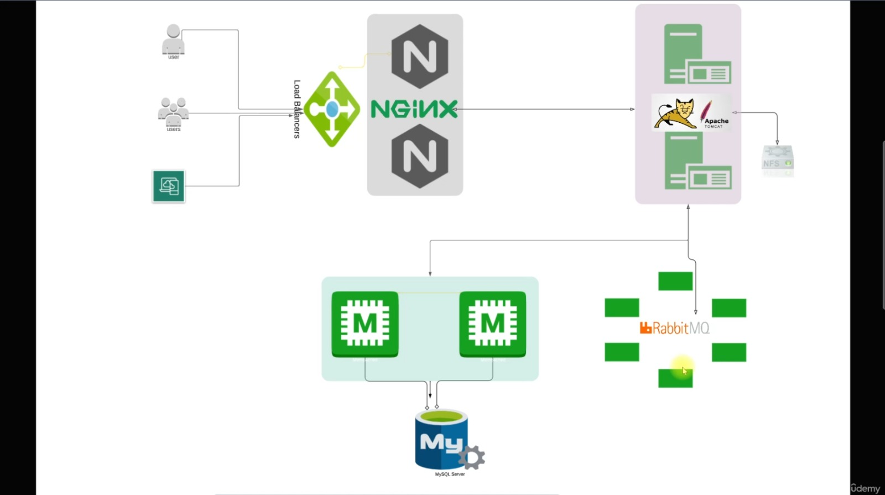

# vProfile Project — Multi-VM Deployment (Manual & Automated with Vagrant)

## 📌 Introduction

The **vProfile Project** is a multi-tier Java web application deployed using **both**:

- **Manual provisioning** (hands-on server setup)
- **Infrastructure as Code (IaC)** using **Vagrant** for automated multi-VM provisioning.

The project simulates a **real-world production environment** with multiple servers, load balancing, caching, message queuing, and a backend database — demonstrating end-to-end DevOps skills.

---

## 🎯 Objectives

- Deploy a **multi-tier architecture** with Nginx, Tomcat, Memcached, RabbitMQ, and MySQL.
- Practice **manual server configuration** to build deep infrastructure understanding.
- Implement **IaC with Vagrant** to automate provisioning.
- Validate environment setup through **application testing**.
- Gain experience in **multi-VM networking, provisioning scripts, and service configuration**.

---

## 🛠 Tools & Prerequisites

### **Tools Used**

- **Vagrant** (IaC automation)
- **VirtualBox** (VM provider)
- **Linux** (Ubuntu / CentOS VMs)
- **Nginx** (Load Balancer)
- **Apache Tomcat** (App Server)
- **Memcached** (Caching layer)
- **RabbitMQ** (Message Broker)
- **MySQL** (Database)
- **Git** (Version control)
- **Bash scripting** (Provisioning)

---

## 🏗 Architecture Overview



**Multi-tier layout:**

- **Load Balancer**: Nginx distributing requests to the backend application server.
- **Application Server**: Apache Tomcat hosting the Java web application.
- **Caching Layer**: Memcached to improve performance by reducing database load.
- **Message Broker**: RabbitMQ handling asynchronous communication between services.
- **Database**: MySQL storing application’s persistent data.

---

## 🖥 Manual Provisioning Steps

Below are **simplified key commands** (full step-by-step available in project docs):

### **1️⃣ MySQL / MariaDB Setup (db01)**

```bash
# SSH into DB server
vagrant ssh db01

# Verify hosts file entries
cat /etc/hosts

# Update OS & install repo
sudo dnf update -y
sudo dnf install epel-release -y

# Install MariaDB & Git
sudo dnf install git mariadb-server -y

# Start & enable MariaDB
sudo systemctl start mariadb
sudo systemctl enable mariadb

# Secure installation (password: admin123, Disallow root login remotely? n)
mysql_secure_installation

# Create DB & user
mysql -u root -padmin123 -e "CREATE DATABASE accounts;
GRANT ALL PRIVILEGES ON accounts.* TO 'admin'@'localhost' IDENTIFIED BY 'admin123';
GRANT ALL PRIVILEGES ON accounts.* TO 'admin'@'%' IDENTIFIED BY 'admin123';
FLUSH PRIVILEGES;"

# Download schema & import
cd /tmp
git clone -b local https://github.com/hkhcoder/vprofile-project.git
mysql -u root -padmin123 accounts < vprofile-project/src/main/resources/db_backup.sql

# Restart DB
sudo systemctl restart mariadb

# Configure firewall
sudo systemctl start firewalld
sudo systemctl enable firewalld
sudo firewall-cmd --zone=public --add-port=3306/tcp --permanent
sudo firewall-cmd --reload
```

### **2️⃣ Memcached Setup (mc01)**

```bash
vagrant ssh mc01
cat /etc/hosts

# Update OS
sudo dnf update -y

# Install Memcached
sudo dnf install epel-release -y
sudo dnf install memcached -y

# Start & enable service
sudo systemctl start memcached
sudo systemctl enable memcached

# Allow remote connections
sudo sed -i 's/127.0.0.1/0.0.0.0/g' /etc/sysconfig/memcached
sudo systemctl restart memcached

# Configure firewall
sudo systemctl start firewalld
sudo systemctl enable firewalld
sudo firewall-cmd --add-port=11211/tcp
sudo firewall-cmd --runtime-to-permanent
sudo firewall-cmd --add-port=11111/udp
sudo firewall-cmd --runtime-to-permanent

# Start Memcached with TCP & UDP listening
sudo memcached -p 11211 -U 11111 -u memcached -d
```

### **3️⃣ RabbitMQ Setup (rmq01)**

```bash
vagrant ssh rmq01
cat /etc/hosts

# Update OS
sudo dnf update -y
sudo dnf install epel-release -y
sudo dnf install wget -y

# Install RabbitMQ
sudo dnf -y install centos-release-rabbitmq-38
sudo dnf --enablerepo=centos-rabbitmq-38 -y install rabbitmq-server
sudo systemctl enable --now rabbitmq-server

# Configure admin user
echo "[{rabbit, [{loopback_users, []}]}]." | sudo tee /etc/rabbitmq/rabbitmq.config
sudo rabbitmqctl add_user test test
sudo rabbitmqctl set_user_tags test administrator
sudo rabbitmqctl set_permissions -p / test ".*" ".*" ".*"

# Restart service
sudo systemctl restart rabbitmq-server

# Configure firewall
sudo systemctl start firewalld
sudo systemctl enable firewalld
sudo firewall-cmd --add-port=5672/tcp
sudo firewall-cmd --runtime-to-permanent
```

### **4️⃣ Tomcat + App Deployment (app01)**

```bash
vagrant ssh app01
cat /etc/hosts

# Update OS & repos
sudo dnf update -y
sudo dnf install epel-release -y
sudo dnf -y install java-17-openjdk java-17-openjdk-devel git wget unzip

# Install Tomcat
cd /tmp
wget https://archive.apache.org/dist/tomcat/tomcat-10/v10.1.26/bin/apache-tomcat-10.1.26.tar.gz
tar xzvf apache-tomcat-10.1.26.tar.gz
sudo useradd --home-dir /usr/local/tomcat --shell /sbin/nologin tomcat
sudo cp -r apache-tomcat-10.1.26/* /usr/local/tomcat/
sudo chown -R tomcat:tomcat /usr/local/tomcat

# Create Tomcat systemd service
sudo tee /etc/systemd/system/tomcat.service <<EOF
[Unit]
Description=Tomcat
After=network.target

[Service]
User=tomcat
Group=tomcat
WorkingDirectory=/usr/local/tomcat
Environment=JAVA_HOME=/usr/lib/jvm/jre
Environment=CATALINA_PID=/var/tomcat/%i/run/tomcat.pid
Environment=CATALINA_HOME=/usr/local/tomcat
Environment=CATALINE_BASE=/usr/local/tomcat
ExecStart=/usr/local/tomcat/bin/catalina.sh run
ExecStop=/usr/local/tomcat/bin/shutdown.sh
RestartSec=10
Restart=always

[Install]
WantedBy=multi-user.target
EOF

sudo systemctl daemon-reload
sudo systemctl start tomcat
sudo systemctl enable tomcat

# Firewall for Tomcat
sudo systemctl start firewalld
sudo systemctl enable firewalld
sudo firewall-cmd --zone=public --add-port=8080/tcp --permanent
sudo firewall-cmd --reload

# Install Maven
cd /tmp
wget https://archive.apache.org/dist/maven/maven-3/3.9.9/binaries/apache-maven-3.9.9-bin.zip
unzip apache-maven-3.9.9-bin.zip
sudo cp -r apache-maven-3.9.9 /usr/local/maven3.9
export MAVEN_OPTS="-Xmx512m"

# Build & deploy app
git clone -b local https://github.com/Maazk111/Multi-Tier-Web-Application-Deployment-Manual-IaC-with-Vagrant.git
cd vprofile-project
vim src/main/resources/application.properties  # update backend service configs
/usr/local/maven3.9/bin/mvn install

sudo systemctl stop tomcat
sudo rm -rf /usr/local/tomcat/webapps/ROOT*
sudo cp target/vprofile-v2.war /usr/local/tomcat/webapps/ROOT.war
sudo chown -R tomcat:tomcat /usr/local/tomcat/webapps
sudo systemctl restart tomcat
```

### **5️⃣ Nginx Setup (web01)**

```bash
vagrant ssh web01
sudo -i
cat /etc/hosts

# Update OS
apt update && apt upgrade -y

# Install Nginx
apt install nginx -y

# Create reverse proxy config
tee /etc/nginx/sites-available/vproapp <<EOF
upstream vproapp {
    server app01:8080;
}
server {
    listen 80;
    location / {
        proxy_pass http://vproapp;
    }
}
EOF

# Remove default config & enable new one
rm -rf /etc/nginx/sites-enabled/default
ln -s /etc/nginx/sites-available/vproapp /etc/nginx/sites-enabled/vproapp

# Restart Nginx
systemctl restart nginx
```

## ⚙ Automated Provisioning with Vagrant

1. Place all provisioning scripts in `vagrant/Automated_provisioning_WinMacIntel/`.
2. Update the **Vagrantfile** with:
   - VM definitions (OS, IPs, hostnames)
   - Shell script provisioning paths
3. Run:

   ```bash
   vagrant up

   ```

## ✅ Verification & Testing

- Access `http://<web01-ip>` in your browser — the application home page should load successfully.
- Log in with test credentials to verify **database connectivity**.
- Confirm the following components are functioning:
  - **Nginx** reverse proxy is routing traffic to the application server.
  - **Tomcat** is serving the Java web application.
  - **Memcached** is connected and caching application data.
  - **RabbitMQ** is operational for message queuing.
  - **MySQL** database queries are executing without errors.

---

## 🗝 Key Takeaways

- Hands-on **Linux service configuration**
- Understanding **multi-tier architecture**
- Building **IaC skills** with Vagrant
- Managing **networking, firewalls, and service dependencies**
- Applying a practical **DevOps deployment workflow**
